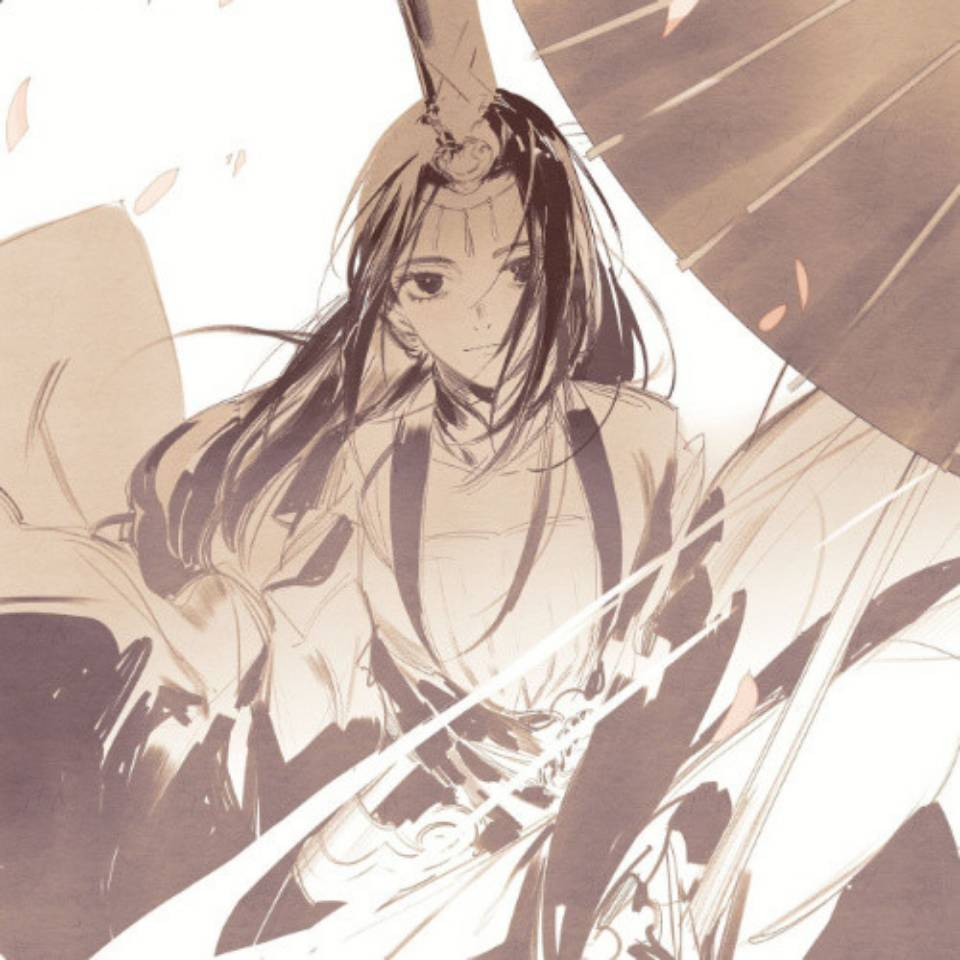

<html>

<body bgcolor="FF6699">
<h1 align="center">尹威凡的个人简介</h1>

请大家注意，迎面走来的是尹威凡小哥哥。他身长八尺有余，而形貌昳丽（bushi）,有亿点点黑，平易近人，喜欢与别人交流。

这名同学生长于河南周口这样一个五线小城市，除了学习成绩一直较好之外，其成长经历与常人无异。天有不测风云，该生中考失利，进入一县城高中就读，而入燕园之抱负不曾改变。数学的弱势让该生饱经沧桑，高考的略微失利也改变了他的人生轨迹。不过其入燕园之梦已遂，料得此孺子定将在燕园中继续挥洒汗水，砥砺前行。

一入燕园门，一生北大人。进入燕园后，该生尝试新事物，挑战自己的能力。军训期间加入国旗班来增加训练量和体验感，返校后参与医预主席团学习部部长竞选，无奈失利，但最终进入学习部成为一名干事，并在十一假期中推出自己的第一篇推文。或许前方的路尚不明晰，该生也一定会勇往直前。

  
<h2><a href="https://mp.weixin.qq.com/s/pVP_C0qmNIFdmTKqN2bl7A">Click here!</a></h2>

作为来自河南的高考生，该生特长不多，只是对声乐有一点了解。平时喜欢唱唱歌、唱唱歌、唱唱歌。尤其喜爱古风，正在努力地寻找小伙伴。

该生思想觉悟较高，具有强烈的爱国情怀。世界观始终与党和人民保持一致，代表着新时代爱国青年的主流思想。曾多次高唱红歌，也阅读过共产党宣言等社会主义著作，立志报效祖国。

<h4>Do you know he is cute?</h4>

